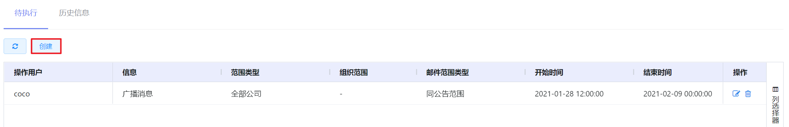
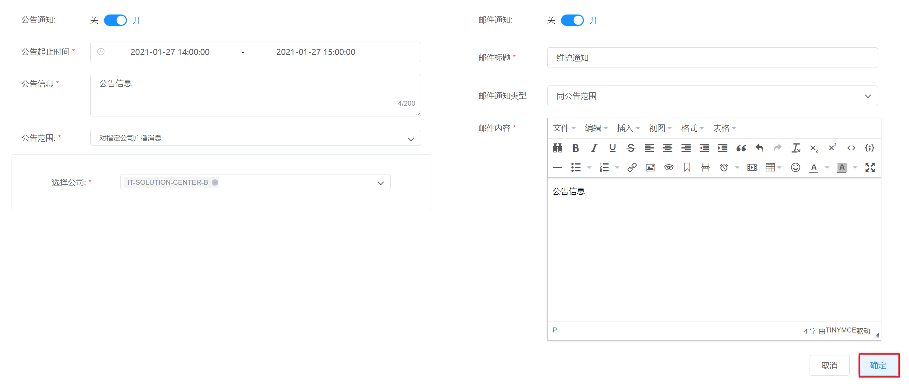
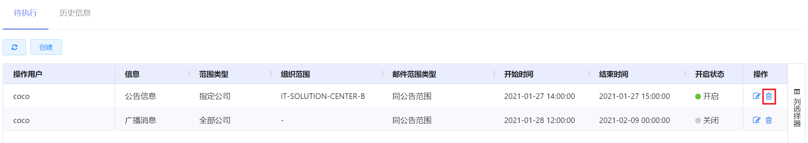

# 7.2.7.公告信息配置

云平台支持管理员公告信息通知，发送邮件通知选定的用户，并且在满足条件时将公告信息在平台页面顶部高亮展示至选定的用户。

在“系统设置”菜单下选择左侧“平台系统配置”的导航菜单，之后点击“公告信息配置”的子菜单，即可看到公告信息配置的管理界面：

当满足以下条件时，会触发平台向组织范围用户推送公告信息的条件：

- 公告信息的状态为“开启“；
- 当前时间在公告信息的开始时间和结束时间区间内。

## 相关操作

HYPERX云管理平台支持超级管理员对公告信息进行配置和管理，支持的功能如下：

- 创建公告信息：创建公告信息，支持同时为选定用户发送邮件通知；
- 编辑公告信息：编辑公告的起始时间、内容、范围等信息；
- 删除公告信息：删除选定的公告信息。

操作入口如下：

- 系统设置→平台系统配置→公告信息配置

##  操作说明

### 创建公告信息

① 在公告信息配置的管理界面中，点击“创建”按钮：

② 将会进入”添加公告信息配置“的页面，填写公告起始时间、内容、范围等信息后，点击“确定”按钮即可添加公告信息：

③ 当满足条件时，系统将公告信息在页面顶部高亮展示的效果如下：

> [!NOTE]
>
> - 如果勾选“公告通知”按钮，将会根据公告的起止时间向公告范围中的用户在平台内页面顶部高亮显示公告信息；如果未勾选该按钮，会将公告信息存为草稿，支持编辑和删除；
> - 仅在创建公告消息时支持启用邮件通知功能，启用后将会根据用户配置的收件人发送邮件；
> - 对于邮件通知，支持发送给公告范围的用户，也支持发送给指定用户。

### 编辑公告信息

① 在公告信息配置的管理界面中，选择需要编辑的公告信息，点击操作列的“编辑”按钮：

② 将会弹出“公告信息编辑”的操作提示框，编辑公告通知、起止时间、公告范围等信息后，点击“确定”按钮更新公告信息：

### 删除公告信息

① 在公告信息配置的管理界面中，选择需要删除的公告信息，点击操作列的“删除”按钮：

② 将会弹出“删除”的操作提示框，点击“确定”按钮，删除选定的公告信息：

